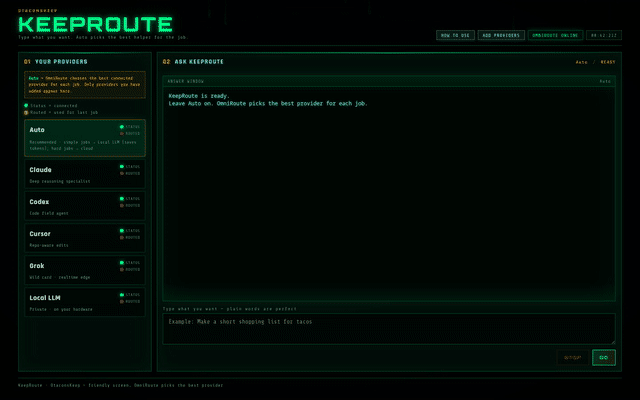

# KeepRoute 1.0

**OtaconsKeep Stateful AI Orchestration**  
**Designed & Engineered by Antonio G. Garcia (Otaconskeep)**  
**Powered by [OmniRoute](https://github.com/diegosouzapw/OmniRoute)** (upstream routing data plane)

[](https://otaconskeep.github.io/keeproute/)
[](LICENSE)
[](https://github.com/diegosouzapw/OmniRoute)
[](https://otaconskeep.github.io/keeproute/)
[](https://youtube.com/shorts/Icc8LA7KIzA)
[](https://discord.gg/cZDeqECzX)

[](https://youtube.com/shorts/Icc8LA7KIzA)

**[Watch the short](https://youtube.com/shorts/Icc8LA7KIzA)** · **[Canonical site](https://otaconskeep.github.io/keeproute/)** · **[Discord](https://discord.gg/cZDeqECzX)**



---

## Start here (no experience required)

| Step | Do this |
|---|---|
| 1 | Read **[What is KeepRoute?](#what-is-keeproute)** (2 minutes) |
| 2 | Read **[OmniRoute vs KeepRoute](#omniroute-vs-keeproute)** so you know why this exists |
| 3 | Follow **[INSTALL.md](INSTALL.md)** — full how-to on your own computer |
| 4 | Optional: skim **[WHY.md](WHY.md)** and the [capability table](#capability-comparison-not-a-scoreboard) |

This repo includes the **KeepRoute field UI package** under [`KeepRoute-UI/`](KeepRoute-UI/) so you can install from GitHub (clone or Download ZIP), not only from the website.

```bash
git clone https://github.com/Otaconskeep/KeepRoute.git
cd KeepRoute
# then open INSTALL.md and follow it in order
```

---

## What is KeepRoute?

**OmniRoute routes a request. KeepRoute owns the mission.**

[OmniRoute](https://github.com/diegosouzapw/OmniRoute) is an excellent upstream gateway:

- one API in
- many providers / models out
- fallback when something is unhealthy
- health / combos / resilience

KeepRoute does **not** replace OmniRoute. KeepRoute is OtaconsKeep’s layer **on top**:

- the **job** gets a Mission ID
- progress can be **checkpointed**
- if Claude hits a limit, a provider fails, Cursor stalls, or the host reboots, KeepRoute can **continue the same mission** on another supported path instead of making you rebuild context by hand

> **The mission is the product. The model is replaceable.**

### Ten-second version

| Product | Job |
|---|---|
| **OmniRoute** | Chooses *where this request goes* among providers and models |
| **KeepRoute** | Owns *the whole job* — watches it, checkpoints it, continues it if the AI has to change |

### What you install

1. **OmniRoute** (Docker) — routing engine / data plane  
2. **KeepRoute UI** (Python/Flask) — the field screen: providers on the left, ask box on the right  
3. **Optional: Mission Controller** — full KeepRoute 1.0 mission policy, checkpoints, handoff (UI works with OmniRoute alone for basic Auto chat)

---

## Project REX · KeepRoute learning feed

**Is KeepRoute / OmniRoute driving or aiding Project REX?** **Both** — on the operator Keep and in **Otacon Expansion Premium v1.3.2+** (clean-room productization).

| Step | What happens |
|---|---|
| 1 | KeepRoute / OmniRoute exchange completes (any supported provider, including local) |
| 2 | Outcome records into a **shared learning pool** (global per install) |
| 3 | World-model rebuild surfaces risks / domain insights (e.g. `domain: keeproute`) |
| 4 | REX treats `world_model:*` as a first-class proposal source on the same board pipeline |

**Global, not local:** learning + world model are one shared pool tagged by domain — tags filter; they do not create per-session islands.

### Wire KeepRoute → Expansion Premium

```bash
export OTACON_EXPANSION_URL=http://127.0.0.1:<expansion-port>
# or set vault field expansion_url
```

After each mission, KeepRoute fail-open POSTs to `/api/expansion/route-learning/ingest`. If Expansion is offline, missions still complete.

| Capability | Operator Keep | Public KeepRoute 1.0 | Expansion Premium v1.3.2+ |
|---|---|---|---|
| Missions / OmniRoute | Yes | Yes | Via KeepRoute |
| Shared learning ← exchanges | Yes | Optional POST into Expansion | Yes (`route_learning`) |
| World model → REX proposals | Yes | Via Expansion when wired | Yes (`world_model:*`) |

Canonical write-up: [otaconskeep.github.io/keeproute/#rex-learning](https://otaconskeep.github.io/keeproute/#rex-learning).

---

## Why it was made

People already had a great way to send chat to many AIs. What kept breaking real Keep workflows was not “pick a model” — it was **losing the job** when that model hit a wall.

A coding session would be halfway done. Claude hit quota. Or Cursor stalled. Or the host rebooted. Stock routing can send the *next* prompt somewhere else — but the human still had to rebuild: what finished, what failed, what files mattered, what not to do twice.

### What we refused to accept

- Trivial “hi” burning paid tokens  
- Every client inventing its own routing rules  
- Starting over after a recoverable failure  
- Replaying a destructive step because the new agent did not know it already ran  

Longer write-up: **[WHY.md](WHY.md)**

---

## OmniRoute vs KeepRoute

```
OtaconsKeep
  └── KeepRoute          ← mission orchestration (this project)
        └── OmniRoute    ← upstream provider/model routing (open source)
```

| | OmniRoute (upstream) | KeepRoute (OtaconsKeep) |
|---|---|---|
| Made for | “Send this chat to the right model.” | “Finish this mission even if the model has to change.” |
| Unit of work | Prompt / response | Mission ID + state |
| On failure | Provider / model fallback | Checkpoint → continue / handoff |
| Ownership | Traffic director | Mission control |

- Upstream OmniRoute: [diegosouzapw/OmniRoute](https://github.com/diegosouzapw/OmniRoute)  
- KeepRoute is **not** “our OmniRoute fork” and is **not** stock OmniRoute  
- You should use OmniRoute — KeepRoute does  

### Capability comparison (not a scoreboard)

We do **not** claim stock OmniRoute is bad. Where stock has no mission-orchestration equivalent, we say so plainly.

| Capability | Stock OmniRoute | KeepRoute 1.0 |
|---|---|---|
| Multiple providers / models | Yes | Uses OmniRoute |
| Provider / model routing | Yes | Uses OmniRoute |
| Provider fallback / combos | Yes | Uses OmniRoute + mission-aware recovery |
| Health / circuit handling | Yes | Uses OmniRoute resilience + KeepRoute supervision |
| Policy-based task classification | Not KeepRoute-style mission policy | Yes |
| Persistent Mission ID | No equivalent mission layer | Yes |
| Persistent mission state | No equivalent mission layer | Yes |
| Checkpoints | Not core stock routing | Yes |
| Completed / remaining work tracking | No equivalent | Yes |
| Unresolved-error preservation | No equivalent | Yes |
| Route history (mission-level) | Request/usage telemetry ≠ mission history | Yes |
| Service restart recovery | No mission-level equivalent | Yes (tested) |
| Full-host reboot recovery | No mission-level equivalent | Yes (verified 2/2 in KeepRoute testing) |
| Stateful model continuation | Fallback ≠ mission continuation package | Yes |
| Cross-agent runtime handoff | No | Yes, supported/tested paths |
| Claude Code → Codex continuation | No | Yes, supported/tested path |
| Multi-hop continuation | No mission multi-hop | Yes |
| Duplicate / destructive action protection | No mission ledger equivalent | Yes |
| Local-first trivial routing | Configurable routing | Policy-enforced local-first for trivial work |
| Operational mission metrics / release gate | Gateway monitoring | Mission soak metrics + release verification |

More visuals + UI screenshots: [keeproute/#compare](https://otaconskeep.github.io/keeproute/#compare) · [keeproute/#ui](https://otaconskeep.github.io/keeproute/#ui)

---

## How it works (concept)

```
You describe a job
        ↓
KeepRoute Mission Controller (when running)
        ↓ policy + classification
OmniRoute (data plane) → Claude / Codex / Cursor / Grok / Local
        ↓
If failure → checkpoint → handoff / continue
        ↓
Mission complete
```

- **Auto** is the normal path: policy picks the route  
- You can force a provider when you want to  
- Cloud providers only see what that mission needs — not “everything on your disk”  

---

## Install KeepRoute on your computer

**Full step-by-step (recommended):** → **[INSTALL.md](INSTALL.md)**

Quick outline:

1. **Requirements:** Linux (or Windows WSL2 Ubuntu), Python 3.10+, Docker, pip. GPU optional (Local AI).  
2. **Get this package** — clone this repo or unzip from the [site download](https://otaconskeep.github.io/downloads/KeepRoute-UI.zip).  
3. **Start OmniRoute** with Docker (`KeepRoute-UI/docker-compose.omniroute.yml`).  
4. **Start KeepRoute UI** (`python3 desk/app.py` → `http://127.0.0.1:20129/`).  
5. **Add providers / keys** inside the UI (never paste keys into Discord or GitHub).  
6. **Test:** `Hi` with Auto, then a small coding ask.  
7. **Optional:** Mission Controller for full 1.0 mission policy (`MISSION_CONTROLLER_URL`).

This is a **detailed self-install**, not a one-click installer. Packaging polish for one-click remains in progress.

---

## Using the UI (after install)

1. Open `http://127.0.0.1:20129/`  
2. Click **ADD PROVIDERS** — connect OmniRoute API key (+ Claude / Codex / Cursor / Grok / Local as you want) — **SAVE KEYS**  
3. Leave **Auto** selected  
4. Type plain words → **GO**  
5. Status lights: green = connected; Routed = used on the last job  

### Provider cheat sheet

| Provider | Notes |
|---|---|
| OmniRoute API key | Usually enough for Auto — create/copy inside OmniRoute dashboard |
| Claude | Cloud · usually paid — connect in OmniRoute first |
| Codex / OpenAI | Cloud · usually paid |
| Cursor | Optional coding agent runtime |
| Grok | Optional cloud |
| Local AI | Ollama (or similar) via OmniRoute — no GPU? skip Local, use cloud |

### Example “ready” screen

```
KeepRoute UI: http://127.0.0.1:20129/
OmniRoute: Connected
Local AI: Connected
Claude: Connected
Codex: Connected
Cursor: Not configured
Grok: Not configured

Routing: Ready
→ OPEN KEEPROUTE
```

---

## Ports (default, loopback)

| Service | URL on your machine |
|---|---|
| OmniRoute (via our compose file) | `http://127.0.0.1:20127` |
| KeepRoute UI | `http://127.0.0.1:20129` |
| Mission Controller (optional) | `http://127.0.0.1:20130` |

Compose maps host **20127** → container internal **20128**. Always set:

```bash
export OMNIROUTE_HOST=http://127.0.0.1:20127
```

when using the compose file in this repo.

---

## Release 1.0 (what shipped)

| Field | Value |
|---|---|
| Product | KeepRoute |
| Version | **1.0** |
| Status | Stable |
| Data plane | OmniRoute (upstream) |
| Builder | OtaconsKeep / Antonio G. Garcia |

**Friendly changelog:** First stable release of mission orchestration — persistent missions, checkpoints, recovery, local-first trivial policy, supported agent handoff, and release-verified soak results.

Sanitized benchmarks, security notes, pros/cons, and limitations:  
https://otaconskeep.github.io/keeproute/#benchmarks

### Honest limits

- No AI system is guaranteed to finish every task  
- A replacement agent cannot inherit another provider’s private hidden reasoning  
- Handoff uses provider-independent mission state (files, decisions, errors, TODOs, tool results, checkpoints)  
- Cloud usage can cost money; outages can exhaust all routes — mission should stop cleanly, not fake success  
- Checkpoints reduce risk; they are not a substitute for backups  
- Benchmarks are release-test results, not universal guarantees  

---

## FAQ

**Why does KeepRoute exist if OmniRoute already routes?**  
OmniRoute routes a request. KeepRoute owns the mission. Long agent jobs kept dying when a single provider failed; KeepRoute checkpoints and continues so you are not rebuilding by hand.

**Is this stock OmniRoute?**  
No. OmniRoute is the data plane. KeepRoute is the mission / orchestration layer on top.

**Did you fork OmniRoute?**  
No. Upstream OmniRoute remains its own project. KeepRoute is OtaconsKeep’s layer around it.

**What happens when Claude reaches its limit?**  
KeepRoute can checkpoint and continue on another eligible provider/agent when the path is supported — not the same as blindly retrying the same prompt.

**Can it use Cursor?**  
Yes, as a supported agent adapter path when configured.

**Can I run everything locally?**  
Simple work can stay local. Heavy coding may still need cloud providers depending on hardware/models.

**Are my API keys public?**  
No. Keys stay on your machine inside KeepRoute / OmniRoute. Never paste them into Discord, email, issues, or this README.

**Does it guarantee every mission completes?**  
No. Release tests showed strong results in measured samples; not a universal guarantee.

**What if my computer restarts?**  
Supported missions can recover from checkpoints after reboot (verified 2/2 host-reboot tests in the 1.0 release set) when Mission Controller / full orchestration is in use.

---

## Repo layout

```
KeepRoute/
  README.md                 ← you are here
  WHY.md                    ← why we built it
  INSTALL.md                ← full how-to
  LICENSE
  KeepRoute-UI/             ← field UI + OmniRoute compose companion
    README.txt
    docker-compose.omniroute.yml
    keeproute-ui.service.example
    desk/                   ← Flask UI (app.py, static, templates)
```

---

## Links

| | |
|---|---|
| This repo | https://github.com/Otaconskeep/KeepRoute |
| Public page | https://otaconskeep.github.io/keeproute/ |
| YouTube Short | https://youtube.com/shorts/Icc8LA7KIzA |
| OmniRoute upstream | https://github.com/diegosouzapw/OmniRoute |
| Otacon Core | https://github.com/Otaconskeep/otacons-ai-ecosystem |
| Discord | https://discord.gg/cZDeqECzX |

---

**ROUTE · RECOVER · CONTINUE // MISSION CONTROL**
